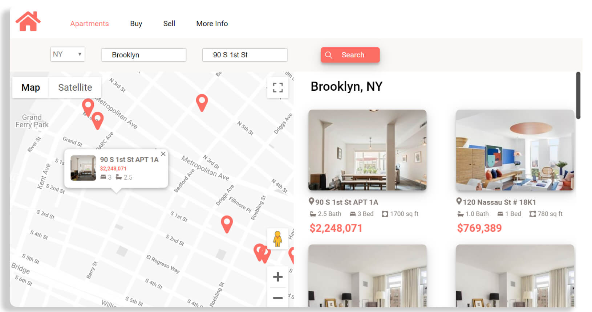
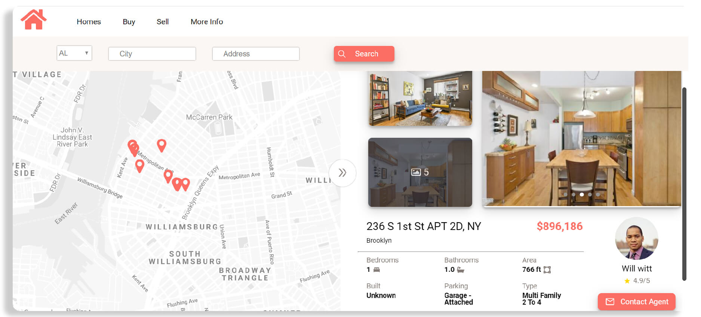

# Real Estate Site

A responsive real estate website that utilizes fetch calls to the Zillow API to return the home and surrounding homes for any address searched. Google maps was utilized to display the location of each home and an AWS server was set up to handle fetch calls to the Zillow API more effectively



<p align="center">
<a href="https://expo.io/@kzitouni/OutClass" target="_blank" >

</a>
</p>

## Installation

Clone and run npm install

```bash
git clone https://github.com/kzitouni/Real_Estate_Site.git
```
```bash
npm install
```


## Development

| Tech | Use|
| ------ | ------ |
| React| Used on the client-side because its fast, scalable, and simple |
| SCSS| Made writing css cleaner |
| Zillow API | Used to fetch live data to display on the site|
| Google Maps API| Used to display each properties location on a map |
| AWS EC2| Used to handle Zillow API Calls and only return necessary data |
| GIT |Version Control|


## Additional Images


